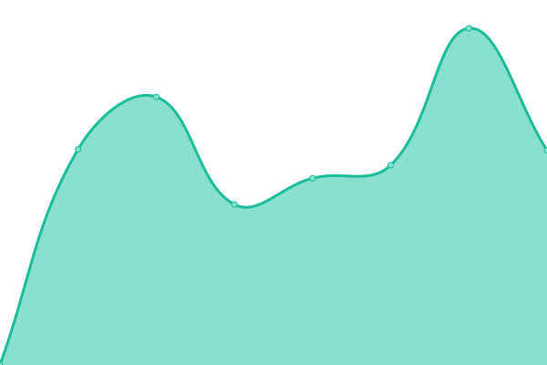
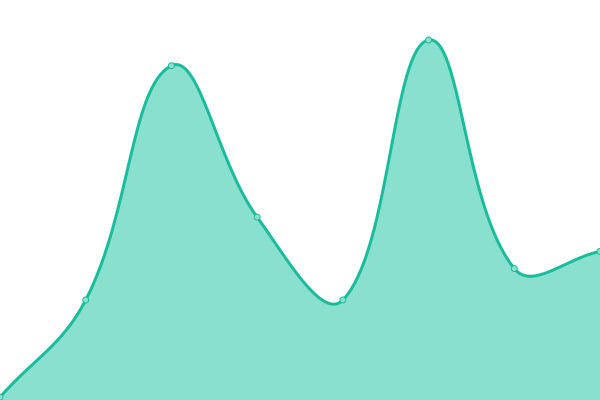

# [📈 Live Status](https://status.bridge.school.nz): <!--live status--> **🟧 Partial outage**

This repository contains the open-source uptime monitor and status page for [Inbox-Design](https://status.bridge.school.nz), powered by [Upptime](https://github.com/upptime/upptime).

With [Upptime](https://upptime.js.org), you can get your own unlimited and free uptime monitor and status page, powered entirely by a GitHub repository. We use [Issues](https://github.com/Inbox-Design/bridge-status/issues) as incident reports, [Actions](https://github.com/Inbox-Design/bridge-status/actions) as uptime monitors, and [Pages](https://status.bridge.school.nz) for the status page.

<!--start: status pages-->
<!-- This summary is generated by Upptime (https://github.com/upptime/upptime) -->
<!-- Do not edit this manually, your changes will be overwritten -->
<!-- prettier-ignore -->
| URL | Status | History | Response Time | Uptime |
| --- | ------ | ------- | ------------- | ------ |
|  [School Bridge App](https://tidewater.bridge.school.nz) | 🟥 Down | [school-bridge-app.yml](https://github.com/Inbox-Design/bridge-status/commits/HEAD/history/school-bridge-app.yml) | 

 141ms
     
 | 

<a href="https://status.bridge.school.nz/history/school-bridge-app">0.00%</a>
    

|  [API 1](https://api-191.bridge.school.nz) | 🟥 Down | [api-1.yml](https://github.com/Inbox-Design/bridge-status/commits/HEAD/history/api-1.yml) | 

 3935ms
     
 | 

<a href="https://status.bridge.school.nz/history/api-1">0.00%</a>
    

|  [API 2](https://api-193.bridge.school.nz) | 🟩 Up | [api-2.yml](https://github.com/Inbox-Design/bridge-status/commits/HEAD/history/api-2.yml) | 

 900ms
     
 | 

<a href="https://status.bridge.school.nz/history/api-2">93.39%</a>
    

|  [SchooBridge Login](https://login.bridge.school.nz) | 🟥 Down | [schoo-bridge-login.yml](https://github.com/Inbox-Design/bridge-status/commits/HEAD/history/schoo-bridge-login.yml) | 

 94ms
     
 | 

<a href="https://status.bridge.school.nz/history/schoo-bridge-login">0.00%</a>
    

<!--end: status pages-->

[**Visit our status website →**](https://status.bridge.school.nz)

## 📄 License

- Powered by: [Upptime](https://github.com/upptime/upptime)
- Code: [MIT](./LICENSE) © [Inbox-Design](https://status.bridge.school.nz)
- Data in the `./history` directory: [Open Database License](https://opendatacommons.org/licenses/odbl/1-0/)
